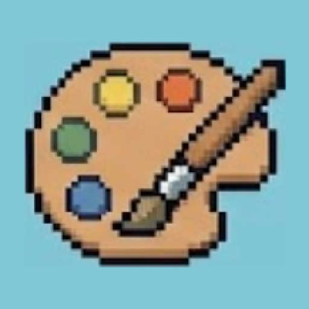
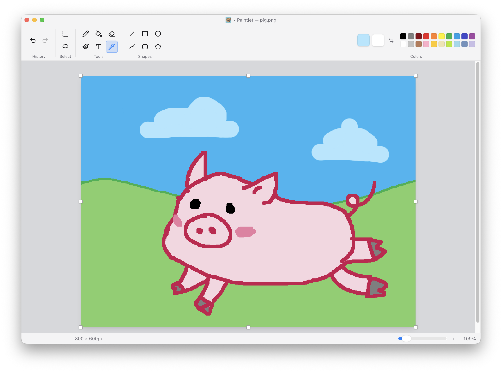

<p align="center">
  
</p>

<h1 align="center">Paintlet</h1>

A MS Paint-style raster editor for macOS. It borrows **Windows 11 Paint's layout and interactions** and renders them in **macOS clothing** — native transparent title bar, SF Pro, system controls, and full dark mode. A Windows Paint user should recognize it in five seconds and still feel it belongs on their Mac.

Built with an HTML `<canvas>` drawing engine inside a Tauri native shell. The name is *paint* plus the diminutive *-let* — a small, light paint app.

<p align="center">
  
</p>

## Download

[**Download the latest Paintlet for macOS →**](https://github.com/lucky-bai/paintlet/releases/latest)

A **universal** build (Apple Silicon + Intel), signed and notarized by Apple — no Gatekeeper warning. Open the `.dmg` and drag **Paintlet** into your Applications folder. Requires macOS 10.15 or later.

## Features

- **Freehand** — pencil, brush, and eraser with a continuous width slider; left button paints Color 1, right paints Color 2.
- **Shapes** — line, curve, rectangle, rounded rectangle, ellipse, and polygon at four widths. Shift constrains to 45°/square/circle; the curve is click-based (two clicks to place, two to bend).
- **Fill & eyedropper** — leak-tight flood fill, plus a color picker that shows the sampled color under the cursor.
- **Text** — multi-line, with a live font preview, size steppers, and bold/italic/underline/strikethrough; reposition before committing.
- **Selection** — rectangular marquee or free-form lasso, with move, eight-grip resize, and transparent backgrounds so a selection never stamps a solid block.
- **Clipboard** — copy / cut / paste (⌘C/⌘X/⌘V) through the system clipboard.
- **Save / Open** — one-step save as PNG or JPEG; the title bar tracks the file and unsaved changes.
- **Image ops** — resize, crop, flip, rotate, and drag any canvas edge to crop or extend — all undoable.
- **Zoom & pan** — 0.25×–8× crisp pixelated scaling, fit-to-window, pinch/⌘-wheel zoom, and space-drag panning.
- **Undo / redo** — ⌘Z / ⇧⌘Z across every edit, including resizes and crops.
- **Native macOS UI** — real menu bar and shortcuts, a Win11-style ribbon, an in-app color picker, the MS Paint palette, and a live status bar.
- **Settings & theme** (⌘,) — System / Light / Dark appearance and default new-image size, both persisted.

Out of scope by design: layers, transparency/alpha, AI features, stickers, and advanced brushes. See [`PLAN.md`](./PLAN.md) for the full design, architecture, and roadmap.

## Tech stack

- **Shell:** Tauri v2 (Rust) — native window, menus, file dialogs, app bundle.
- **Frontend:** Vite + React 19 + TypeScript.
- **Styling:** Tailwind v4 (CSS-first) with light/dark theme tokens.
- **State:** Zustand for UI/config; pixel data lives in an imperative canvas engine, never in React.

## Getting started

**Prerequisites:** Node 18+, pnpm, the Rust toolchain, and Xcode Command Line Tools.

```bash
pnpm install
pnpm dev            # run the desktop app in development
pnpm tauri build    # produce a macOS app bundle
pnpm dev:web        # frontend only, in a browser (native menus/dialogs disabled)
```

To cut a signed, notarized release DMG for distribution, see [`docs/RELEASING.md`](./docs/RELEASING.md).

## Tests

```bash
pnpm test           # Vitest unit tests (pure logic: fill, history, geometry)
pnpm test:e2e       # headless-browser smoke test: boots the web build and
                    # drives it with real pointer/keyboard input, asserting
                    # by reading pixels back off the canvases
```

CI (GitHub Actions) runs build → unit tests → e2e on every pull request.

## Architecture in brief

Three stacked canvases drive everything:

1. **Base** — the committed image, the source of truth, saved to disk.
2. **Overlay** — transparent; live previews render here and clear constantly.
3. **Selection** — the marching-ants marquee (rect or lasso outline) and any floating (moved/pasted) pixels, composited into the base on commit.

Every action previews on the overlay, then on pointer-up composites into the base and pushes a history snapshot. Because everything ends as pixels, undo, selection, and text all reduce to the same commit mechanism. Tools implement one shared `Tool` interface, so adding a tool is a single file.

```
src/
├─ engine/      # CanvasEngine, History, coords, floodFill, color
├─ tools/       # Tool interface + one file per tool + registry
├─ components/  # Toolbar, CanvasStage, ColorControls, StatusBar, dialogs, …
├─ io/          # file open/save + system clipboard
├─ menu/        # native macOS menu bar
├─ state/       # Zustand store + stage hooks + viewport ref
├─ lib/         # zoom bounds, SVG cursors, cx
├─ actions.ts   # shared commands for the menu + keyboard
└─ styles/      # Tailwind entry + theme tokens
tests/          # headless-browser e2e smoke (unit tests live in src/**/*.test.ts)
src-tauri/      # Rust shell (file I/O commands), capabilities, config
```

## License

[MIT](./LICENSE) © 2026 Bai Li
