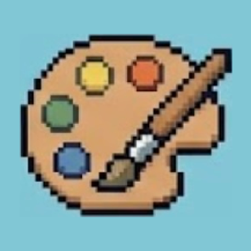
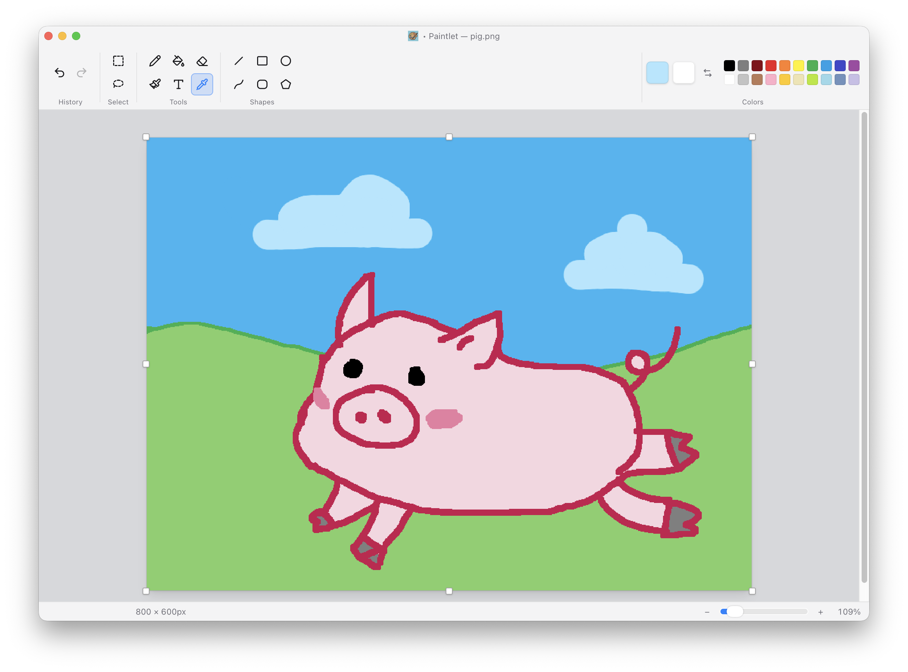

<p align="center">
  
</p>

<h1 align="center">Paintlet</h1>

<p align="center">
  <a href="https://github.com/lucky-bai/paintlet/actions/workflows/ci.yml"></a>
  <a href="https://github.com/lucky-bai/paintlet/releases/latest"></a>
  <a href="./LICENSE"></a>
</p>

<p align="center">
  <a href="https://paintlet.app/"><strong>Website</strong></a>
  ·
  <a href="https://github.com/lucky-bai/paintlet/releases/latest"><strong>Download</strong></a>
</p>

A MS Paint-style raster editor for macOS. It borrows Windows 11 Paint's layout and interactions, then dresses them in macOS: transparent native title bar, SF Pro, system controls, full dark mode. If you know Windows Paint, the tools sit where you'd expect them to.

Built with an HTML `<canvas>` drawing engine inside a Tauri native shell. The name is *paint* plus the diminutive *-let*: a small paint app.

<p align="center">
  
</p>

## Download

[**Download the latest Paintlet for macOS →**](https://github.com/lucky-bai/paintlet/releases/latest)

A universal build (Apple Silicon + Intel), signed and notarized by Apple, so there's no Gatekeeper warning. Open the `.dmg` and drag Paintlet into your Applications folder. Requires macOS 10.15 or later.

## Features

- **Freehand.** Pencil, brush, and eraser on a continuous width slider. The left button paints Color 1, the right paints Color 2.
- **Shapes:** line, curve, rectangle, rounded rectangle, ellipse, and polygon at four widths. Shift constrains to 45°/square/circle. The curve is click-based (two clicks to place, two to bend).
- Leak-tight **flood fill**, plus an **eyedropper** that shows the sampled color under the cursor.
- **Text** is multi-line, with a live font preview, size steppers, and bold/italic/underline/strikethrough. Reposition the box before you commit it.
- **Selection:** rectangular marquee or free-form lasso, with move, eight-grip resize, and arrow-key nudging. Backgrounds stay transparent, so a selection won't stamp a solid block.
- Copy, cut, and paste (⌘C/⌘X/⌘V) go through the system **clipboard**.
- **Save / Open.** Opens PNG, JPEG, GIF, WebP, BMP, and HEIC. Saving is one step: PNG, JPEG, BMP, or GIF, picked from the save panel's format popup. The title bar tracks the file and unsaved changes.
- **Image ops:** resize, crop, flip, and rotate, all undoable. Dragging any canvas edge crops or extends it.
- **Zoom & pan.** 0.25×–8× crisp pixelated scaling, fit-to-window, pinch or ⌘-wheel zoom, and space-drag panning.
- **Undo / redo** with ⌘Z / ⇧⌘Z across every edit, resizes and crops included.
- **Native macOS UI:** a real menu bar and shortcuts, a Win11-style ribbon, an in-app color picker, the MS Paint palette, and a live status bar.
- **Shortcuts that match Paint.** `S P B T E I` for the six tools Windows Paint gives a letter to (`S` again swaps marquee for lasso), arrows to nudge a selection a pixel at a time, `⌘Y` or `⇧⌘Z` to redo, `Esc` to cancel. Paintlet doesn't invent bindings for keys Paint leaves free.
- **Settings & theme** (⌘,): Light by default, with Dark and System appearance, persisted across launches.

Out of scope by design: layers, transparency/alpha, AI features, stickers, and advanced brushes. See [`PLAN.md`](./PLAN.md) for the full design and architecture.

## Tech stack

- **Shell:** Tauri v2 (Rust) for the native window, menus, file dialogs, and app bundle.
- **Frontend:** Vite + React 19 + TypeScript.
- **Styling:** Tailwind v4 (CSS-first) with light/dark theme tokens.
- **State:** Zustand for UI/config. Pixel data lives in an imperative canvas engine, outside React.

## Getting started

**Prerequisites:** Node 18+, pnpm, the Rust toolchain, and Xcode Command Line Tools.

```bash
pnpm install
pnpm dev            # run the desktop app in development
pnpm tauri build    # produce a macOS app bundle
pnpm dev:web        # frontend only, in a browser (native menus/dialogs disabled)
```

To cut a signed, notarized release DMG for distribution, see [`docs/RELEASING.md`](./docs/RELEASING.md).

## Tests

```bash
pnpm test           # Vitest unit tests (pure logic: fill, history, geometry)
pnpm test:e2e       # headless-browser smoke test: boots the web build and
                    # drives it with real pointer/keyboard input, asserting
                    # by reading pixels back off the canvases
```

CI (GitHub Actions) runs build → unit tests → e2e on every pull request, plus `cargo fmt` and `cargo clippy` on macOS whenever `src-tauri/` changes.

## Architecture in brief

Three stacked canvases drive everything:

1. **Base** is the committed image, the source of truth, saved to disk.
2. **Overlay** is transparent; live previews render here and clear constantly.
3. **Selection** carries the marching-ants marquee (rect or lasso outline) and any floating (moved/pasted) pixels, composited into the base on commit.

Every action previews on the overlay, then composites into the base on pointer-up and pushes a history snapshot. Everything ends as pixels, so undo, selection, and text share one commit path. Tools implement a single `Tool` interface, which keeps a new tool down to one file.

```
src/
├─ engine/      # CanvasEngine, History, coords, floodFill, color
├─ tools/       # Tool interface + one file per tool + registry
├─ components/  # Toolbar, CanvasStage, ColorControls, StatusBar, dialogs, …
├─ io/          # file open/save + system clipboard
├─ menu/        # native macOS menu bar
├─ state/       # Zustand store + stage hooks + viewport ref
├─ lib/         # zoom bounds, SVG cursors, cx
├─ actions.ts   # shared commands for the menu + keyboard
└─ styles/      # Tailwind entry + theme tokens
tests/          # headless-browser e2e smoke (unit tests live in src/**/*.test.ts)
src-tauri/      # Rust shell (file I/O commands), capabilities, config
```

## License

[MIT](./LICENSE) © 2026 Bai Li
